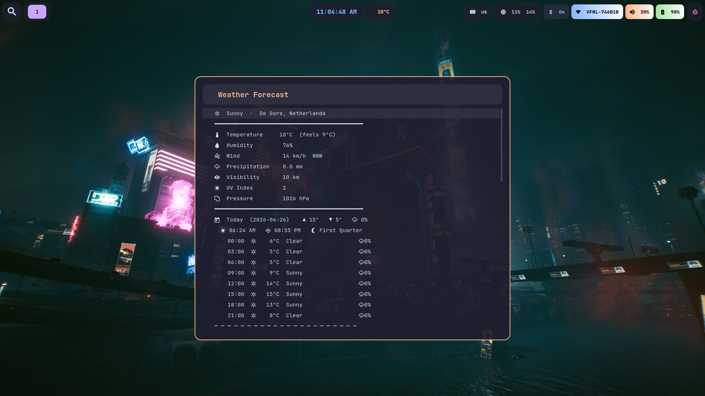

# Gentoo Hyprland Desktop Setup

Automated installer that transforms a minimal Gentoo system into a fully configured Hyprland Wayland desktop with Catppuccin theming, custom Waybar widgets, Rofi popups, and all the trimmings.



## What you get

- **Hyprland** Wayland compositor with polished config
- **Waybar** with weather, Bluetooth, media player, CPU/RAM, WiFi, volume, and battery widgets
- **Rofi** application launcher and interactive popup panels
- **Kitty** terminal with transparency and JetBrains Mono font
- **Mako** notification daemon (Catppuccin themed)
- **PipeWire** audio with WirePlumber tuning for stable speaker/BT audio switching
- **Bluetooth** with interactive Rofi-based pairing/management
- **NetworkManager** with Rofi WiFi picker
- **imv** Wayland-native image viewer (set as default for all image types)
- **Brave** browser, Telegram, Zoom, LibreOffice, GNOME Calendar
- **NVIDIA Optimus** support (Intel iGPU + NVIDIA dGPU with runtime PM)
- **nftables** firewall (SSH-only inbound)
- **GRUB** with gentoo_glass theme
- **Cyberpunk wallpaper** via hyprpaper/waypaper
- **Starship** prompt with Catppuccin colors
- **zsh** with fzf, bat, fastfetch on login

## Prerequisites

A working minimal Gentoo install with:

- Booted and running (**systemd** init, not OpenRC)
- Kernel installed and booting (`gentoo-kernel` dist-kernel recommended)
- GRUB bootloader configured
- Network connectivity (ethernet or WiFi via `wpa_supplicant`)
- `fstab` configured for your disk layout
- Root access

The target machine must have an **Intel CPU** and **NVIDIA GPU**.

## Usage

On the target machine (as root):

```bash
# Install git and clone the repo
emerge -q dev-vcs/git
git clone https://github.com/zara2stra/gentoo-hyprland-setup.git
cd gentoo-hyprland-setup

# Run the installer
./install.sh --user johndoe --password 's3cret!' --hostname mygentoo

# With custom timezone:
./install.sh --user johndoe --password 's3cret!' --hostname mygentoo --timezone America/New_York
```

The script will:

1. Configure Portage (USE flags, overlays, keywords)
2. Install ~75 packages (this takes hours on first run)
3. Create the user account
4. Deploy all dotfiles and configs
5. Set up system configs (firewall, NVIDIA, GRUB, Bluetooth, udev)
6. Enable systemd services
7. Rebuild initramfs and GRUB config
8. Offer to reboot

After reboot, log in on TTY1 and Hyprland starts automatically.

## Parameters

| Flag | Required | Default | Description |
|------|----------|---------|-------------|
| `--user` | Yes | - | Username to create |
| `--password` | Yes | - | Password for the new user |
| `--hostname` | Yes | - | Machine hostname |
| `--timezone` | No | `Europe/Amsterdam` | Timezone |

## Repo structure

```
portage/           Portage config (make.conf, world, USE flags, keywords, overlays)
dotfiles/          User dotfiles (~/.config/* and shell rc files)
  hypr/            Hyprland config + lock screen + idle + 16 scripts
  waybar/          Waybar config and CSS
  rofi/            Rofi launcher and popup themes
  kitty/           Kitty terminal config
  mako/            Notification daemon config
  wireplumber/     PipeWire/WirePlumber audio tuning
  gtk-3.0/         GTK3 dark theme settings
  gtk-4.0/         GTK4 dark theme settings
  waypaper/        Wallpaper manager config
  cava/            Audio visualizer config
  udiskie/         USB automount config
  fastfetch/       System info display config
  shell/           .zshrc and .zprofile
  starship.toml    Starship prompt theme
system/            System configs (root-owned)
  udev/            NVIDIA runtime PM, keyboard backlight
  modprobe.d/      NVIDIA kernel module options
  grub/            GRUB defaults
  bluetooth/       BlueZ config
  nftables.conf    Firewall rules
assets/            Wallpaper image and GRUB theme
install.sh         Master install script
```

## Hardware notes

- `MAKEOPTS` is auto-detected from CPU core count
- `VIDEO_CARDS="intel nvidia"` is set globally
- Keyboard backlight udev rule only applies if `asus::kbd_backlight` is detected
- `fstab` is not touched (handled during base Gentoo install)
- Kernel config is not included (dist-kernel auto-configures)

## Post-install

- Change wallpaper: run `waypaper` from Rofi
- Bluetooth: click the Waybar Bluetooth widget
- WiFi: click the Waybar network widget
- Screenshots: `Print Screen` (region select), `Shift+Print` (region + edit), `Super+Print` (fullscreen)
- Images: double-click any image in Thunar to open in imv
- Power menu: click the power icon in Waybar
